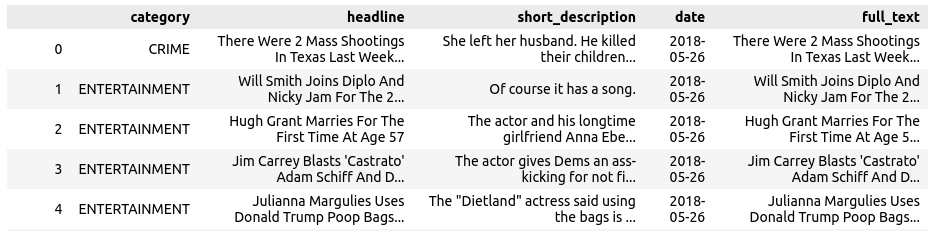
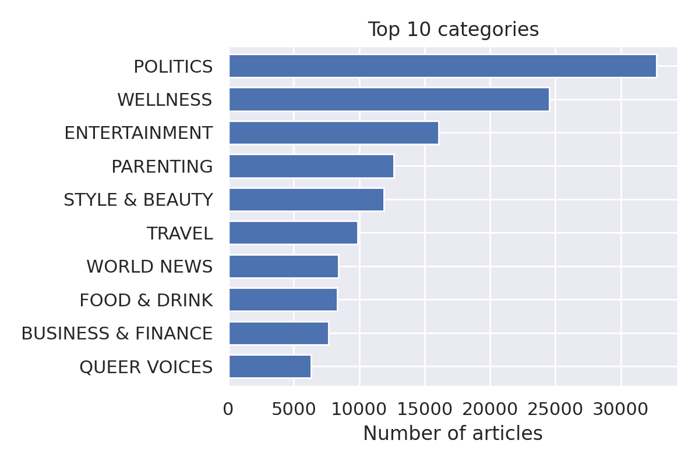
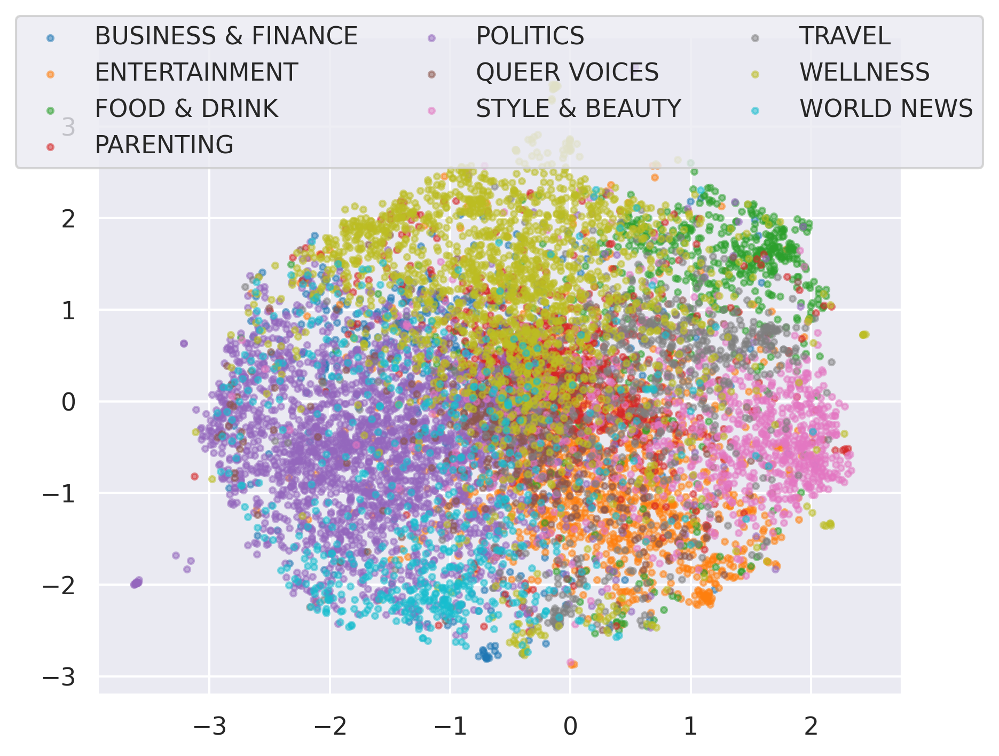
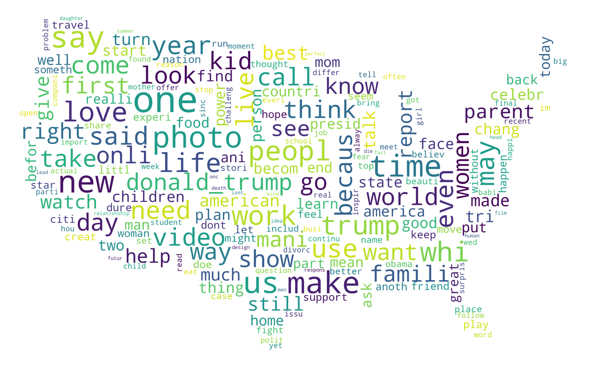
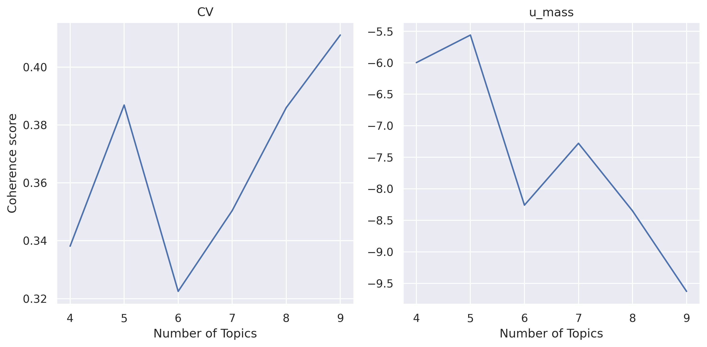
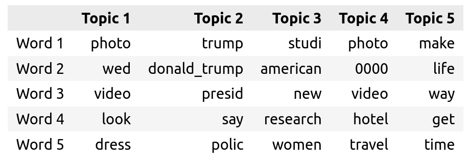

The report should contain an introduction to the problem and to the data, a description (not in detail) of the methods applied, an analysis of the results and conclusions. The maximum number of pages is 15 (exceptions are made for reports with many images).

# Text classification & Topic modelling on HuffPost articles

## Problem
The problem we considered was to categorize news articles based on their headlines and short descriptions, furthermore we would like to find discussion topics in the corpus and their evolution over time.

## Dataset
The dataset is composed of around 200k news headlines and summaries from year 2012 to 2018 obtained from HuffPost, the dataset is available at https://www.kaggle.com/datasets/rmisra/news-category-dataset.

The dataset contains, among others, the following columns:

* category: the category of the article.
* headline: the headline of the article.
* short_description: the short description of the article.
* date: the date the article was published.
* full_text: is a derived column by the concatenation of headline and short_description, whenever we use the term article we always refer to this column of the dataset.

Below we show the first 5 rows of the dataset.



Huffpost is an american news aggregator and blog and covers a vast variety of topics including, politics, business, entertainment, tech, lifestyle and others [4].  
Rather than using data from a single outlet ex CNN, MSNBC, Fox, and so on, using articles from a news aggregator should help to have a more balanced view of the discussion topics. However, it must be said, that the site "was created to provide a liberal alternative to the conservative news websites such as the Drudge Report" [4]. So it can't be considered to have an unbiased view of the world.

## Data cleaning

### Text cleaning

To clean the article text, which is represented by the "full_text" column, we performed the following preprocessing steps is the following order:

* Lowercase all words: New York --> new york
* Replace all numbers with zeros: 2016 -> 0000
* Remove Hashtags: #America --> $hashtag (the regex used was `#[a-z0-9_]+`)
* Remove punctuation, in particular ```!"#&\'()*+,-./:;<=>?@[\\]^_`{|}~```
* Stemming with SnowballStemmer
* Remove Stopwords with list from `nltk.stopwords`
* Join bigram collocations: the first 1000 by pmi

For the punctuation notice that we didn't remove the symbols `%` and `$`, that's because we think those symbols would give insight on the category since the articles also talk about business and finance.  

As for the bigram collocations, joining the first 1000 was chosen manually by inspecting the collocations.

Finally, we din't perform lemmatisation because the spacy preprocessing pipeline, even by disabling everyting apart from the lemmatizer, took about 30ms per document, and, considering that we have 200k documents that would have taken us two hours.

### Category merging

The articles, as we said, are classified in 41 categories, however a lot of these categories are duplicates or very similar. For example:
* ARTS, ARTS & CULTURE, CULTURE & ARTS
* WELLNESS, HEALTY LIVING
* FOOD & DRINK, TASTE

This has happened, among other reasong, because the huffpost has renamed some of the categories during the data collection process.

To solve this problem we decided to merge the following groups of categories into one:

* HEALTHY LIVING, WELLNESS --> WELLNESS 
* STYLE, STYLE & BEAUTY --> STYLE & BEAUTY
* PARENTS, PARENTING --> PARENTING
* TASTE, FOOD & DRINK --> FOOD & DRINK
* BUSINESS, BUSINESS & FINANCE --> BUSINESS & FINANCE
* MONEY, BUSINESS & FINANCE --> BUSINESS & FINANCE
* THE WORLDPOST, WORLD NEWS --> WORLD NEWS
* WORLDPOST, WORLD NEWS --> WORLD NEWS
* TECH, SCIENCE & TECH --> SCIENCE & TECH
*  SCIENCE, SCIENCE & TECH --> SCIENCE & TECH
* GREEN, ENVIRONMENT --> ENVIRONMENT
* CULTURE & ARTS, ARTS & CULTURE --> ARTS & CULTURE
* ARTS, ARTS & CULTURE --> ARTS & CULTURE
* COLLEGE, EDUCATION --> EDUCATION

After the merging process we were left with 29 categories, below we show a barplot of the 10 most common categories.



## Data exploration

### T-SNE
Even though we already explored the data in the previous sections to perform data cleaning, we decided to perform a T-SNE to see how the high-dimensional data distirbution looks like.  
The T-SNE was performed on a random subset of 10000 documents belonging in the 10 most common categories, since running it on the whole dataset would have taken too long.  
Below we show the projected data in 2D space.



From the projection we can see that the data is distributed uniformly in a single circular cluster, with a lot of mixing between the classes, this could be due to the fact that we projected the data on a 2D space, or that the headline and the summary of the articles don't provide enough information to determine its category.


### WordCloud
To show the most commonly used terms in the articles and also to summarize the overall topic of discussion of the dataset we decided to create a WordCloud with the `wordcloud` python library[5].  



We see that politics dominates the debate with words like trump or donald_trump occuring a lot, other relevant words are women, america, travel, family, among others. Finally, we have a lot of generic words that can be found basically everywhere on the internet like: good, photo, one, make, show, go, new and so on.


## Topic modeling

To perform topic modelling we used gensim LDA, we also tried to use sklearn LDA and SVD/NMF but their results were subpar with respect to gensim.  
To find the best number of topics we ran gensim LDA on a random subset of 25000 articles, of these 20000 were used for training and 5000 for evaluation. The evaluation metrics used were umass and cv score.  
As for the huperparameters we set `alpha=eta=1/n_topics` which are the default values.



We see a spike at 5 topics in both the cv and u_mass scores, so we decided to train an LDA model on the whole corpus using `num_topics=5`.

The topics of discussion that the model managed to extract from the data are the following:



Topic 1 seems to talk about weddings, topic 2 about trump and obama, topic 3 about hotels and travels, topic 4 is very broad maybe we can associate it to lifestyle or family, finally topic 5 talks about research and health.


## References
1. News category dataset. https://www.kaggle.com/datasets/rmisra/news-category-dataset
2. Takuya Akiba, Shotaro Sano, Toshihiko Yanase, Takeru Ohta, and Masanori Koyama. 2019. Optuna: A Next-generation Hyperparameter Optimization Framework. In KDD.
3. distilbert-base-uncased. https://huggingface.co/docs/transformers/model_doc/distilbert
4. Huffpost on Wikipedia. https://en.wikipedia.org/wiki/HuffPost
5. WordCloud python library. https://github.com/amueller/word_cloud