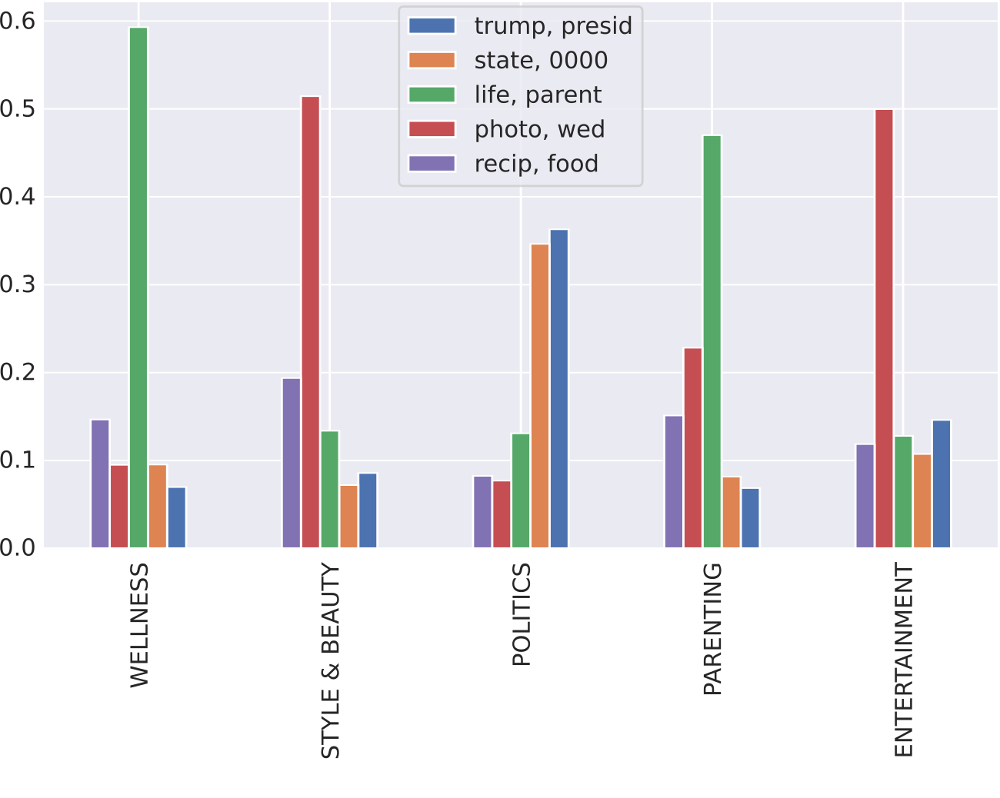
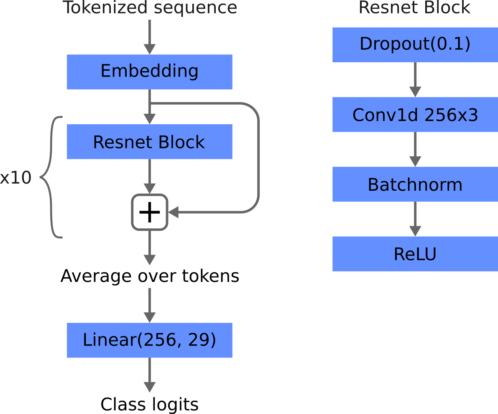

# Text classification & Topic modelling on HuffPost articles

## Problem
The problem we considered is to classify news articles based on their headlines and short descriptions. Furthermore, since we have a big corpus of articles, we would like to find discussion topics in the corpus, how they relate to the categories of the dataset and show the evolution of the topics over time.

## Dataset
The dataset is composed of around 200k news headlines and summaries from year 2012 to 2018 obtained from HuffPost, the dataset is available at https://www.kaggle.com/datasets/rmisra/news-category-dataset.

The dataset contains, among others, the following columns:

* category: the category of the article.
* headline: the headline of the article.
* short_description: the short description of the article.
* date: the date the article was published.
* full_text: is a derived column by the concatenation of headline and short_description, whenever we use the term article we always refer to this column of the dataset.

Below we show the first 5 rows of the dataset.


Huffpost is an american news aggregator and blog and covers a vast variety of topics including, politics, business, entertainment, tech, lifestyle and others [4].  
Rather than using data from a single outlet ex CNN, MSNBC, Fox, and so on, using articles from a news aggregator should help to have a more balanced view of the discussion topics. However, it must be said, that the site "was created to provide a liberal alternative to the conservative news websites such as the Drudge Report" [4]. So it can't be considered to have an unbiased view of the world.

## Data cleaning

### Text cleaning

To clean the article text, which is represented by the "full_text" column, we performed the following preprocessing steps is the following order:

* Lowercase all words: New York --> new york
* Replace all numbers with zeros: 2016 -> 0000
* Remove Hashtags: #America --> $hashtag (the regex used was `#[a-z0-9_]+`)
* Remove punctuation, in particular ```!"#&\'()*+,-./:;<=>?@[\\]^_`{|}~```
* Stemming with SnowballStemmer
* Remove Stopwords with list from `nltk.stopwords`
* Join bigram collocations: the first 1000 by pmi

For the punctuation notice that we didn't remove the symbols `%` and `$`, that's because we think those symbols would give insight on the category since the articles also talk about business and finance.  

As for the bigram collocations, joining the first 1000 was chosen manually by inspecting the collocations.

Finally, we din't perform lemmatisation because the spacy preprocessing pipeline, even by disabling everyting apart from the lemmatizer, took about 30ms per document, and, considering that we have 200k documents that would have taken us two hours.

### Category merging

The articles, as we said, are classified in 41 categories, however a lot of these categories are duplicates or very similar. For example:
* ARTS, ARTS & CULTURE, CULTURE & ARTS
* WELLNESS, HEALTY LIVING
* FOOD & DRINK, TASTE

This has happened, among other reasong, because the huffpost has renamed some of the categories during the data collection process.

To solve this problem we decided to merge the following groups of categories into one:

* HEALTHY LIVING, WELLNESS --> WELLNESS 
* STYLE, STYLE & BEAUTY --> STYLE & BEAUTY
* PARENTS, PARENTING --> PARENTING
* TASTE, FOOD & DRINK --> FOOD & DRINK
* BUSINESS, BUSINESS & FINANCE --> BUSINESS & FINANCE
* MONEY, BUSINESS & FINANCE --> BUSINESS & FINANCE
* THE WORLDPOST, WORLD NEWS --> WORLD NEWS
* WORLDPOST, WORLD NEWS --> WORLD NEWS
* TECH, SCIENCE & TECH --> SCIENCE & TECH
*  SCIENCE, SCIENCE & TECH --> SCIENCE & TECH
* GREEN, ENVIRONMENT --> ENVIRONMENT
* CULTURE & ARTS, ARTS & CULTURE --> ARTS & CULTURE
* ARTS, ARTS & CULTURE --> ARTS & CULTURE
* COLLEGE, EDUCATION --> EDUCATION

After the merging process we were left with 29 categories, with a high imbalance for example politics has 32739 articles while latino voices only has 1129. Below we show a barplot of the 10 most common categories.


## Data exploration

### T-SNE
Even though we already explored the data in the previous sections to perform data cleaning, we decided to perform a T-SNE to see how the high-dimensional data distirbution looks like.  
The T-SNE was performed on a random subset of 10000 documents belonging in the 10 most common categories, since running it on the whole dataset would have taken too long.  
Below we show the projected data in 2D space.


From the projection we can see that the data is distributed uniformly in a single circular cluster, with a lot of mixing between the classes, this could be due to the fact that we projected the data on a 2D space, or that the headline and the summary of the articles don't provide enough information to determine its category.


### WordCloud
To show the most commonly used terms in the articles and also to summarize the overall topic of discussion of the dataset we decided to create a WordCloud with the `wordcloud` python library[5].  


We see that politics dominates the debate with words like trump or donald_trump occuring a lot, other relevant words are women, america, travel, family, among others. Finally, we have a lot of generic words that can be found basically everywhere on the internet like: good, photo, one, make, show, go, new and so on.


## Topic modeling

### Choosing the number of topics

To perform topic modelling we used gensim LDA, we also tried to use sklearn LDA and SVD/NMF but their results were subpar with respect to gensim.  
To find the best number of topics we ran gensim LDA on a random subset of 25000 articles, of these 20000 were used for training and 5000 for evaluation. The evaluation metrics used were umass and cv score.  
As for the huperparameters we set `alpha=eta=1/n_topics` which are the default values.


We see a spike at 5 topics in both the cv and u_mass scores, so we decided to train an LDA model on the whole corpus using `num_topics=5`.

The topics of discussion that the model managed to extract from the data are the following:


Topic 1 seems to talk about weddings, topic 2 about trump and us presidents, topic 3 talks about research and health, but also about women, topic 4 talks about hotels and travels, finally topic 5 is very broad, maybe we can associate it to lifestyle or family subjects. 

### Topics by category

To see how the topics relate to the categories of the dataset, we used the learned topic model to assign a topic distribution to each article, and grouped the article by category. For presentation purposes we only show the top 5 categories.



As we thought topic 5 (make, life) is mostly related to the wellness and parent category, apart from that, the other topics are related to what we expect, for example topic 2 mostly relates to politics and topic 1 to style & beauty.

### Topics by year

To see the evolution of these topics over time we grouped them by year:


We can see that after 2013 the news became more and more politicized with topic (trump, presid) gaining more and more attention year by year. This obviously is due to the 2016 presedential elections that took place in the US. An interesting fact, however, is that the topic did not peak in 2016, rather it continued to gain attention till 2018, until the data stops. The other topic of discussion seem to decrease over time, we think this is a consequence of topic (trump, presid) gaining more interest.  


## Text classification

In the dataset each article is labeled, after the category merging process, in 29 categories. So we decided to classify news articles based on the `full_text` column, which is the concatenation of the article headline and summary.

First of all we splitted the data into train and test sets as follows:
* The train set is composed of articles published in 2012 up to 2017
* The test set is composed of articles published in 2017 and 2018 and comprises 20% of the data.

We think this train-test split is more representative of the use-case of a text classification model, since we want the model to generalize well and classify correctly articles that will be published in the future.

Whenever we need to set some hyperparameters we use an evaluation set, which is composed of a random sample of 20% of the train set.

Finally, to evaluate how a model is performing we will use 4 metrics:
1. F1 weighted: The multiclass F1 score weighted by the number of samples in each class
2. F1 macro: The multiclass F1 score un-weighted by the number of samples in each class, i.e. classes with low samples are just as important as classes with a high amount of samples.
3. Training time: The time to train the whole model
4. Evaluation time: The time to predict a single example

### Naive bayes

The first model that we tried is Multinomial Naive Bayes. This model assumes that all the features are independent from each other. This is a big assumption, however these models have been used in the past to classify email spam, furthermore they are very fast to train and evaluate [6]. We hope that this simple model will provide a good baseline for further improvement.

This model requires word counts so we used a bag of words to represent each document. The bag of words was created on the uncleaned text with sklearn `CountVectorizer` with parameters:
* lowercase=True
* min_df=0.00003
* max_df=0.7
* strip_accents="unicode"
* ngram_range=(1, 2)
* stop_words="english"

The choice to use the uncleaned text rather than the cleaned text was made by seeing the performance on the validation set, in particular the model trained on the uncleaned text managed to get a slight improvement of 0.01 in the F1 scores. However, it must be noted that the text was not completely uncleaned, we simply cleaned it with sklearn `CountVectorizer` rather than using our pipeline.

The naive bayes model managed to get.
* F1 weighted: 0.61
* F1 macro: 0.36
* Training time: 8 s
* Evaluation time: 34us/doc 

### Logistic regression

In this case we used sklearn `TfidfVectorizer` with the same parameters as `CountVectorizer` before. However, the logistic regression classifier has one more hyperparameter `C` which regulates the amount of L2 regularization applied. To set this parameter we minimized the F1 weighted score on the validation set using Optuna, a bayesian optimization library [2], which found the optimal value to be $C \approx 3.5$ .


The logistic regression model managed to get.
* F1 weighted: 0.64
* F1 macro: 0.40
* Training time: 23 s
* Evaluation time: 35 us/doc

### CNN/LSTM

Due to the recent success of Deep Learning approaches to the field of NLP we decided to try a CNN and LSTM model to perform text classification.  

In this models we used a custom tokenizer on the `full_text_cleaned` column of the dataset. The tokenizer applies dynamic padding, which means that it pads all documents to the max length of alla the documents in the **batch** this reduces training times by a lot while also avoiding to truncate sequences.

The CNN model can be seen in the picture below, it has 11M parameters and 256 embedding dimension.




Even though the model is very complex it doesn't manage to get the same performance of logistic regression and takes a very long time to train to reach F1 scores on par to naive bayes.

* F1 weighted: 0.38
* F1 macro: 0.58
* Training time: 10 min
* Evaluation time: 90 us/doc


The LSTM model, instead, is composed of 5 stacked LSTMs and has 14M parameters with 256 embedding dimension.


As with the CNN model, even though the model is very complex it doesn't manage to surpass regularized logistic regression.

* F1 weighted: 0.37
* F1 macro: 0.58
* Training time: 14 min
* Evaluation time: 130 us/doc

It must be noted that in both the CNN and LSTM models train and evaluation time are computed on a Nvidia T4 GPU, training and evaluating them on CPU would take at least 10 times more.

### Transformer

Finally, we tried to use a pretrained transformer to classify the articles, the specific model used is distilbert-base-uncased which is a distillation of bert-base-uncased. The model with respect to bert-base-uncased is: 
* More parameter efficent: 40% less parameters
* 60% faster
* Preserves over 95% of performances in the GLUE benchmark [3]

The model was trained for one epoch using the huggingface transformer api following distilbert-base-uncased fine tuning guide [here](https://huggingface.co/docs/transformers/tasks/sequence_classification).
The final performance is a major improvement in the F1 scores than all the previous model, at the cost of more compute time.

* F1 weighted: 0.45
* F1 macro: 0.68
* Training time: 20 min
* Evaluation time: 1600 us/doc


### Results

To summarize all the results of the text classification experiments, we used two bar plots, as we think the reader can appreciate more the difference in performance this way.


We can say that Naive bayes is very fast to train, evaluate and provides decent results. Logistic regression is better than naive bayes in any metric apart from the training time, which takes about 3 times more.

As for the neural network models CNN and LSTM are very slow to train and evaluate, and have worse F1 scores than logistic regression. We can confidently say that in any task and any situation a logistic regression model will be a better choice than any of these two models.

The transformer is the model that performs best in terms of F1 scores, however it takes a huge time to evaluate and train with respect to logreg or naive bayes. This model can be used when we need accurate predictions or when computing resources are not a problem.

## Conclusion

We took a dataset of 200k Huffpost articles and analyzed the topic of discussion using a topic model. This model demonstrated how the US news have become more and more politicized, with the topic talking about the US president donald trump becoming the main subject of discussion over the years and still growing in 2018, where the data collection process stops.  

We also trained text classification models to classify a news article based on its headline and summary, the goodness of a model was measured not only using F1 scores, but also with training and evaluation time, as we think they are of paramount importance in a production scenario. The best model in terms of raw performance was a fine-tuning of a distilbert-base-uncased transformer model, which manages to get a F1_weighted score of 0.68 at the cost of a high evaluation and training time. A simpler and lighter model we considered is logistic regression, which takes less that 1/100 to train and evaluate w.r.t. distilbert-base-uncased with only a decrease of 0.04 in F1 score.


## References
1. News category dataset. https://www.kaggle.com/datasets/rmisra/news-category-dataset
2. Takuya Akiba, Shotaro Sano, Toshihiko Yanase, Takeru Ohta, and Masanori Koyama. 2019. Optuna: A Next-generation Hyperparameter Optimization Framework. In KDD.
3. distilbert-base-uncased. https://huggingface.co/docs/transformers/model_doc/distilbert
4. Huffpost on Wikipedia. https://en.wikipedia.org/wiki/HuffPost
5. WordCloud python library. https://github.com/amueller/word_cloud
6. Naive Bayes spam filtering. https://en.wikipedia.org/wiki/Naive_Bayes_spam_filtering